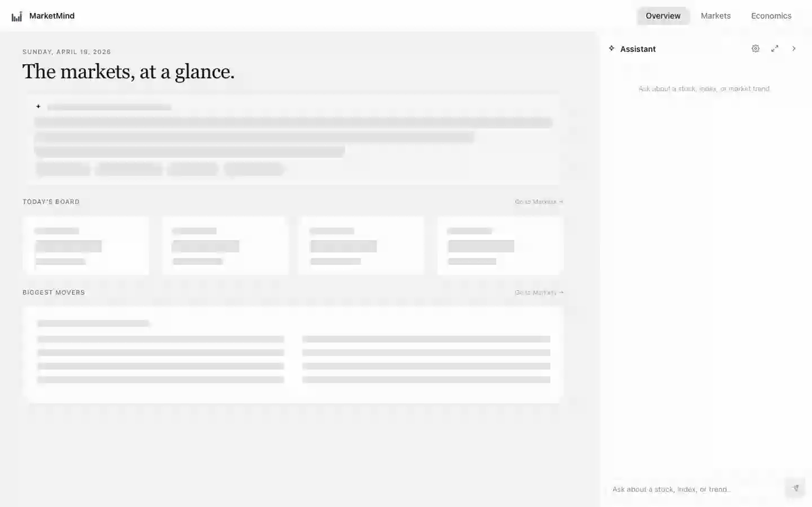
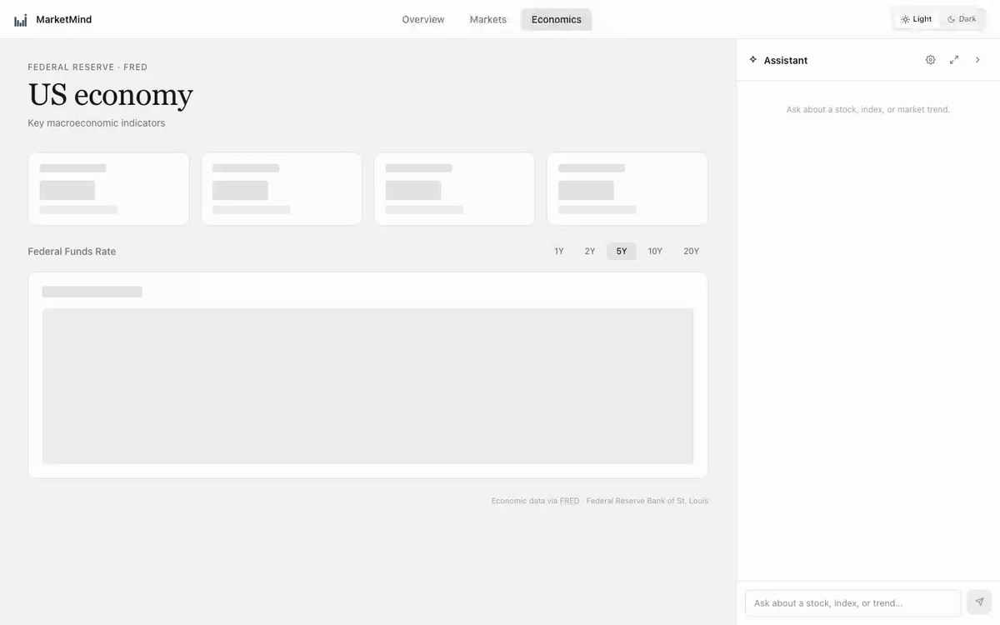

# MarketMind

An AI-powered finance and economics dashboard. Ask questions about markets and economic data in natural language — Claude looks up live data, reasons about it, and streams an answer back.

## Screenshots

### Overview


### Economics Explorer


---

## What it does

- **Overview** — editorial landing page with an AI market briefing (Claude, plain English), a live board (S&P 500, 10Y Yield, 30Y Mortgage Rate, VIX), and a top movers table (gainers vs. losers)
- **Markets** — live S&P 500, NASDAQ, and Dow Jones index cards with an interactive OHLCV price chart (1W / 1M / 3M / 6M / 1Y)
- **Economics** — key US macro indicators from the Federal Reserve (FRED): Fed Funds Rate, CPI, Unemployment, 10-Year Treasury Yield. Includes a live FRED series search and category browser with an interactive line chart.
- **AI Chat** — streaming conversation powered by Claude. Remembers the full session history. Configurable verbosity, model, and theme. Chat rail supports drag-to-resize and pop-out modal mode.

## Architecture

```
Browser (Next.js)
  └── TopNav (Overview / Markets / Economics) + ChatRail
        │
        │ HTTP / SSE
        ▼
FastAPI Backend (Python)
  ├── GET  /api/market/overview
  ├── GET  /api/market/history/{symbol}
  ├── GET  /api/market/board
  ├── GET  /api/market/movers
  ├── GET  /api/economics/overview
  ├── GET  /api/economics/history/{series_id}
  ├── GET  /api/economics/search
  ├── GET  /api/economics/categories
  ├── GET  /api/economics/categories/{id}/series
  ├── GET  /api/overview/briefing
  └── POST /api/chat  (SSE stream + meta event)
        │
        │ Anthropic SDK + MCP stdio
        ▼
Claude (claude-opus-4-6 / sonnet / haiku)
        │
        │ MCP protocol
        ▼
MCP Server (Python / FastMCP)
  ├── get_stock_quote          yfinance
  ├── get_historical_prices    yfinance
  ├── get_market_overview      yfinance
  ├── get_board_data           yfinance + FRED
  ├── get_movers               yfinance
  ├── search_ticker            yfinance
  ├── get_economic_overview    FRED API
  ├── get_economic_series      FRED API
  ├── search_fred              FRED API
  ├── get_fred_categories      FRED API
  ├── get_category_series      FRED API
  └── get_fred_series_info     FRED API
```

## Tech stack

| Layer | Technology |
|---|---|
| Frontend | Next.js 15, TypeScript, Tailwind CSS v4, next-themes |
| Charts | Recharts |
| Backend | Python, FastAPI, uvicorn |
| AI | Anthropic SDK (`claude-opus-4-6` default) |
| MCP Server | Python `mcp` package, FastMCP |
| Market data | `yfinance` (free, no key needed) |
| Economic data | FRED API via `fredapi` + direct REST |
| Package manager (Python) | `uv` |
| Package manager (Node) | `npm` |

## Prerequisites

- Node.js 22+
- Python 3.11+
- `uv` — install with `curl -LsSf https://astral.sh/uv/install.sh | sh`
- API keys (see below)

## Setup

### 1. Clone and enter the repo

```bash
git clone <your-repo-url>
cd marketmind
```

### 2. Backend — set your API key

```bash
cp backend/.env.example backend/.env
# Edit backend/.env and add your Anthropic API key
# ANTHROPIC_API_KEY=sk-ant-...
```

Get a key at [console.anthropic.com](https://console.anthropic.com) → API Keys.

### 3. MCP server — set your FRED API key

```bash
cp mcp-server/.env.example mcp-server/.env
# Edit mcp-server/.env and add your FRED API key
# FRED_API_KEY=...
```

Get a free key at [fred.stlouisfed.org/docs/api/api_key.html](https://fred.stlouisfed.org/docs/api/api_key.html).

### 4. Install dependencies

```bash
# Backend
cd backend && uv sync && cd ..

# MCP server
cd mcp-server && uv sync && cd ..

# Frontend
cd frontend && npm install && cd ..
```

## Running locally

Open three terminals:

```bash
# Terminal 1 — Backend (port 8000)
cd backend
uv run uvicorn main:app --reload --port 8000

# Terminal 2 — MCP server (kept alive for backend to spawn)
cd mcp-server
uv run python main.py

# Terminal 3 — Frontend (port 3000)
cd frontend
npm run dev
```

Visit [http://localhost:3000](http://localhost:3000).

## Capturing demo GIFs

With the app running, use the included Playwright script to record animated screenshots for the README:

```bash
# Install Playwright (first time only)
cd scripts
npm install
npx playwright install chromium

# Run the capture script
node capture-demo.mjs
```

Output GIFs are written to `docs/`. Drop them in and push — the README image links will resolve automatically.

## Testing the MCP tools

The MCP Inspector lets you call tools interactively without the frontend:

```bash
cd mcp-server
uv run mcp dev main.py
```

## Project structure

```
marketmind/
├── README.md
├── plan.md                        ← phase-by-phase build plan
├── progress.md                    ← detailed session log
├── docs/                          ← demo GIFs (generated by scripts/capture-demo.mjs)
├── scripts/
│   └── capture-demo.mjs           ← Playwright GIF capture script
├── backend/
│   ├── main.py                    ← FastAPI — 11 endpoints + Claude SSE agent
│   ├── agent.py                   ← standalone CLI agent (dev/testing)
│   └── pyproject.toml
├── frontend/
│   ├── app/
│   │   ├── layout.tsx             ← root shell (TopNav + ChatRail)
│   │   ├── page.tsx               ← Overview landing page
│   │   ├── icon.svg               ← browser tab favicon
│   │   ├── markets/page.tsx       ← live market cards + OHLCV chart
│   │   └── economics/page.tsx     ← FRED indicators + search/browse + chart
│   ├── components/
│   │   ├── TopNav.tsx             ← Overview / Markets / Economics tabs + icon
│   │   └── ChatRail.tsx           ← collapsible, resizable, pop-out AI chat
│   └── package.json
└── mcp-server/
    ├── main.py                    ← 12 MCP tools (yfinance + FRED)
    └── pyproject.toml
```

## Roadmap

- [x] MCP server with live market data (yfinance)
- [x] Claude agent wired to MCP tools
- [x] FastAPI backend with streaming SSE chat
- [x] Next.js frontend with charts and dark/light theme
- [x] Chat settings — model, verbosity, theme
- [x] Conversation memory
- [x] FRED economic data tools (MCP layer)
- [x] Backend economics endpoints
- [x] Navigation restructure (Overview / Markets / Economics)
- [x] Economics page (indicator cards + FRED search/browse + line chart)
- [x] Overview landing page (AI briefing, board, movers)
- [x] App icon + SVG favicon
- [x] Chat rail drag-to-resize + pop-out modal
- [ ] Loading skeletons + error boundaries
- [ ] Symbol search / watchlist
- [ ] Mobile-responsive layout
